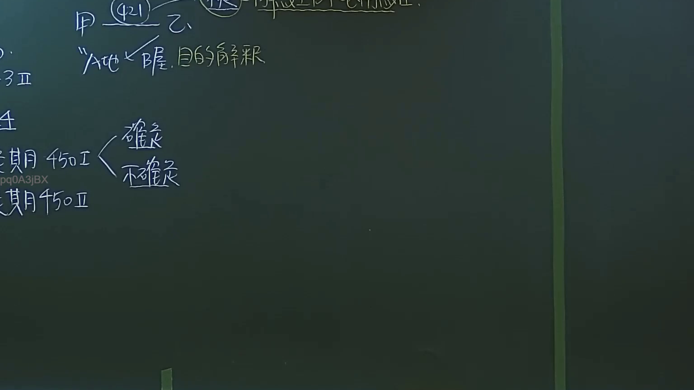

# 🎥 影音教材板書校對筆記
- **來源影片**: [預約27 2024-09-05 01-34-00-883](file:///J:/民法/ch27/預約27 2024-09-05 01-34-00-883.mp4)
- **課程分類**: `[民法`
- **課堂章節**: `ch27]`
- **影片時間戳記**: `03:07:00` (11220 秒)
- **板書類型**: `影音板書`
- **偵測時間**: 2026-07-19 16:45:51

## 🔍 擷取黑板板書對照圖


## 🧠 AI 智慧理解與知識庫演化註記
：
1. 板書文字辨識：
   - 頂部：甲 (421) 乙、A地、B屋、目的解釋
   - 左側：450 I 確定期、450 II 不確定期

2. 法律學理與法條對照：
   - 民法第421條（租賃之定義）：板書提到「甲、乙、A地、B屋」，顯示這是典型的租賃契約案例架構，探討租賃標的（土地與房屋）與法律行為之解釋。
   - 「目的解釋」：在法律行為解釋中，應探求當事人之真意，不得拘泥於所用之辭句（民法第98條）。板書暗示當對於租賃物之範圍或契約目的有爭執時，應採目的解釋法。
   - 民法第450條（租賃契約之消滅）：板書明確列出第450條第1項與第2項。
     - 第450條第1項：租賃定有期限者，其租賃關係，於期限屆滿時消滅。此即「確定期」租賃。
     - 第450條第2項：租賃未定期限者，各當事人得隨時終止契約。但有利於承租人之習慣者，從其習慣。此即「不確定期」租賃之終止規則。

## 📊 可編輯之 Mermaid 關係流程圖
```mermaid
：
graph TD
    A["民法第421條 租賃契約"] --> B["甲 (出租人)"]
    A --> C["乙 (承租人)"]
    B --> D["標的物 A地 / B屋"]
    D --> E["法律行為解釋 目的解釋"]
    F["民法第450條 租賃消滅"] --> G["450條第1項 確定期"]
    F --> H["450條第2項 不確定期"]
```

## ✍️ 操作者手動校對修改區
<!-- 您可以直接修改上方的文字或調整 Mermaid 區塊中的節點，Obsidian 會即時重新渲染 -->
- [ ] 欄位結構與法律邏輯已校對無誤。
- **校對筆記**: 
