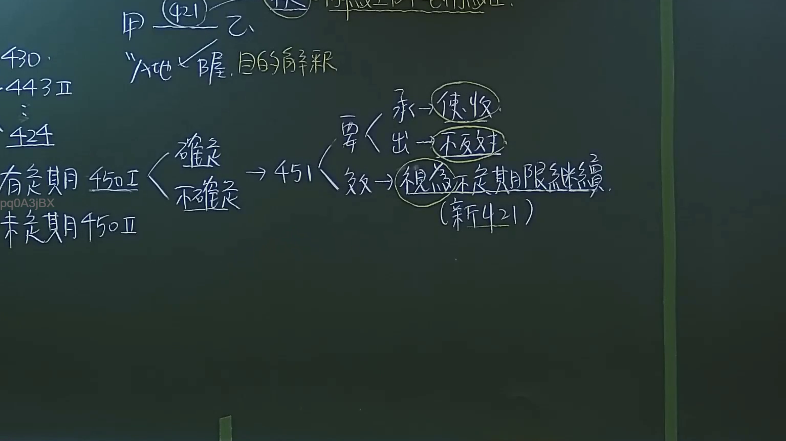

# 🎥 影音教材板書校對筆記
- **來源影片**: [預約27 2024-09-05 01-34-00-883](file:///J:/民法/ch27/預約27 2024-09-05 01-34-00-883.mp4)
- **課程分類**: `[民法`
- **課堂章節**: `ch27]`
- **影片時間戳記**: `03:12:00` (11520 秒)
- **板書類型**: `影音板書`
- **偵測時間**: 2026-07-19 16:45:58

## 🔍 擷取黑板板書對照圖


## 🧠 AI 智慧理解與知識庫演化註記
：
本板書主要解析臺灣民法「租賃契約」關於租期屆滿後之法律效果，特別聚焦於民法第451條「默示更新」之規定。

1. **辨識內容摘要**：
   - 頂部提及「421」及「土地、屋」與「目的解釋」。
   - 左側條文引註：430、443條II、424條、450條I（有定期）、450條II（未定期）。
   - 核心流程：租賃期間屆滿後（450條I），若承租人繼續使用收益（承），而出租人不即表示反對（出），依民法第451條規定，視為以不定期限繼續契約（新421）。

2. **法律學理與法條對照**：
   - **民法第451條（租賃之默示更新）**：規定「租賃期限屆滿後，承租人仍為租賃物之使用收益，而出租人不即表示反對之意思者，視為以不定期限繼續契約。」這是租賃法中保護承租人居住權益與維護交易穩定性的重要規定。
   - **民法第421條（租賃之定義）**：租賃契約為諾成契約，針對土地或房屋之使用目的，常透過目的解釋來界定契約性質。
   - **民法第450條**：區分租賃契約之有定期與不定期。當原定期契約屆滿後，若符合451條要件，租期會發生「轉化」效果，由有定期轉為不定期，此變動影響後續解約權（如453條、454條）的行使。
   - **實務邏輯**：出租人的「不表示反對」視為默示承諾，法律效果為直接變更契約期限。

## 📊 可編輯之 Mermaid 關係流程圖
```mermaid
：
graph TD
    A["民法第451條默示更新"] --> B["要件"]
    B --> C["承租人：繼續使用收益"]
    B --> D["出租人：不即表示反對"]
    A --> E["效果"]
    E --> F["視為以不定期限繼續契約"]
    F --> G["適用新421租賃規定"]
    H["租賃契約"] --> I["450條I：有定期"]
    H --> J["450條II：未定期"]
    I --> A
```

## ✍️ 操作者手動校對修改區
<!-- 您可以直接修改上方的文字或調整 Mermaid 區塊中的節點，Obsidian 會即時重新渲染 -->
- [ ] 欄位結構與法律邏輯已校對無誤。
- **校對筆記**: 
