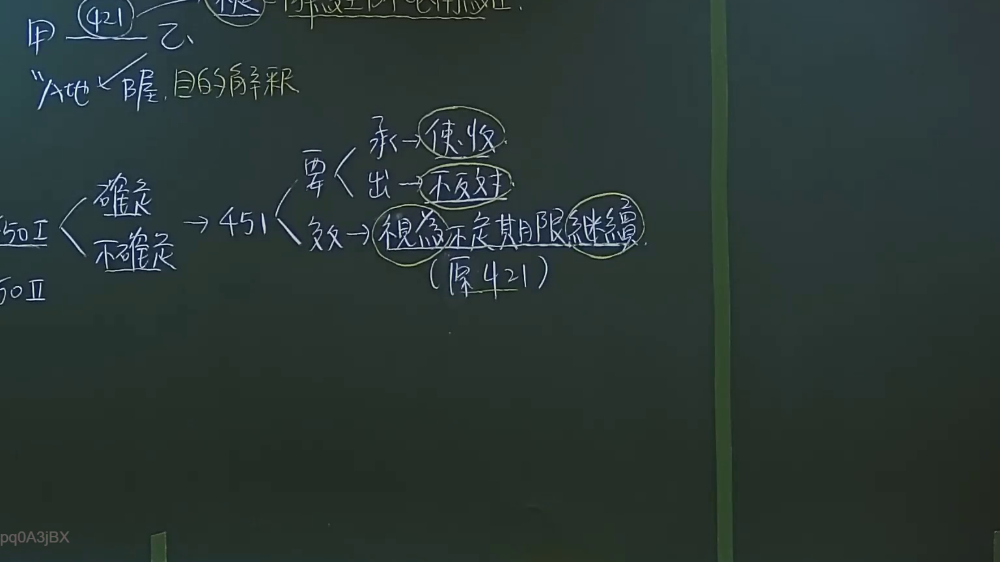

# 🎥 影音教材板書校對筆記
- **來源影片**: [預約27 2024-09-05 01-34-00-883](file:///J:/民法/ch27/預約27 2024-09-05 01-34-00-883.mp4)
- **課程分類**: `[民法`
- **課堂章節**: `ch27]`
- **影片時間戳記**: `03:15:30` (11730 秒)
- **板書類型**: `影音板書`
- **偵測時間**: 2026-07-19 16:46:05

## 🔍 擷取黑板板書對照圖


## 🧠 AI 智慧理解與知識庫演化註記
：
本板書核心在於闡述《民法》租賃契約中關於租期屆滿後之法律效果，特別是針對「默示更新」（租賃契約之更新）的論理。

1. **文字內容辨識**：
   - 左上方提及「421」與「甲 乙」、「A地/B屋」的解釋，應是指民法第421條租賃契約之定義。
   - 左方提及「501」、「502」（推測為租賃章節相關條文），並區分「確定」與「不確定」租期。
   - 核心邏輯指向「451」（民法第451條：租賃期限屆滿後，承租人仍為租賃物之使用收益，而出租人不即表示反對之意思者，視為以不定期限繼續契約）。
   - 右方結構解析：
     - 要件：承（承租人）使用、出（出租人）不反對。
     - 效力：視為不定期限繼續（原421條租約內容）。

2. **法條對照與法律邏輯**：
   - **民法第451條（默示更新）**：這是本板書的核心。當定期租賃契約期滿，若發生「承租人繼續使用收益」且「出租人不即表示反對」兩要件，法律擬制（視為）雙方成立「不定期租賃」。
   - **學理演化**：此為法律為了保護承租人權益與維持經濟活動穩定而設的強制擬制規定。
   - **實務應用**：需特別注意民法第451條之適用前提為「原契約屆滿」，且在定期轉為不定期後，適用民法第450條第2項之終止規定，出租人若無法定事由，將難以要求承租人遷出。

## 📊 可編輯之 Mermaid 關係流程圖
```mermaid
：
graph LR
    A["租賃契約期限屆滿"] --> B{"狀態判斷"}
    B --> C["承租人使用收益"]
    B --> D["出租人未即表示反對"]
    C & D --> E["民法第451條：默示更新"]
    E --> F["視為不定期限繼續契約"]
    F --> G["原421條租賃內容持續有效"]
```

## ✍️ 操作者手動校對修改區
<!-- 您可以直接修改上方的文字或調整 Mermaid 區塊中的節點，Obsidian 會即時重新渲染 -->
- [ ] 欄位結構與法律邏輯已校對無誤。
- **校對筆記**: 
