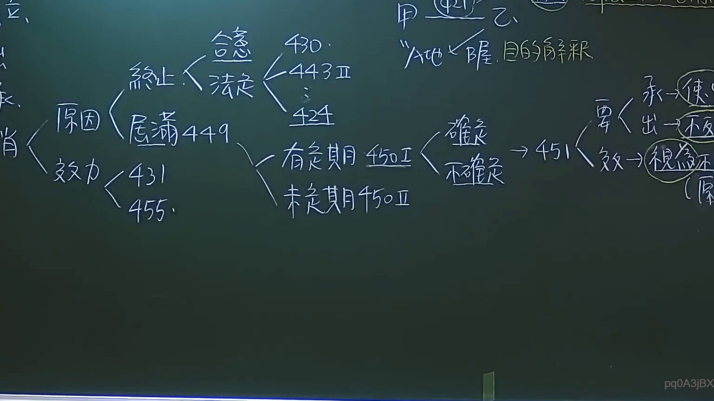

# 🎥 影音教材板書校對筆記
- **來源影片**: [預約27 2024-09-05 01-34-00-883](file:///J:/民法/ch27/預約27 2024-09-05 01-34-00-883.mp4)
- **課程分類**: `[民法`
- **課堂章節**: `ch27]`
- **影片時間戳記**: `03:20:15` (12015 秒)
- **板書類型**: `影音板書`
- **偵測時間**: 2026-07-19 16:46:11

## 🔍 擷取黑板板書對照圖


## 🧠 AI 智慧理解與知識庫演化註記
：

本板書係針對臺灣民法「租賃契約」消滅原因及相關法律效果之體系架構整理，重點整理如下：

1. **租賃契約之消滅原因**：
   - **終止**：分為「合意終止」與「法定終止」。
     - 法定終止事由包含：民法第430條（修繕義務）、第443條第2項（轉租）、第424條（危及健康）。
   - **屆滿**：指租賃期限屆滿，依民法第449條規定。
2. **租賃消滅之效力**：
   - 包含民法第431條（有益費用償還請求權）及第455條（租賃物返還義務）。
3. **租期分類與默示更新**：
   - 租期分為「有定期」（民法第450條第1項）與「未定期」（民法第450條第2項）。
   - 針對有定期租賃，分為「確定期限」與「不確定期限」，並連結至民法第451條「租賃契約之默示更新」。
   - 民法第451條之要件包含：租期屆滿後承租人「繼續使用收益」、出租人「不即表示反對」，法律效果即「視為不定期租賃」。

## 📊 可編輯之 Mermaid 關係流程圖
```mermaid
：

graph LR
    A["租賃契約消滅"] --> B["終止"]
    A --> C["屆滿 (449)"]
    A --> D["效力"]
    B --> E["合意"]
    B --> F["法定"]
    F --> G["430"]
    F --> H["443 II"]
    F --> I["424"]
    D --> J["431"]
    D --> K["455"]
    C --> L["有定期 (450 I)"]
    C --> M["未定期 (450 II)"]
    L --> N["確定"]
    L --> O["不確定"]
    N --> P["451 (默示更新)"]
    O --> P
    P --> Q["承租人繼續使用收益"]
    P --> R["出租人不即表示反對"]
    P --> S["效力：視為不定期"]
```

## ✍️ 操作者手動校對修改區
<!-- 您可以直接修改上方的文字或調整 Mermaid 區塊中的節點，Obsidian 會即時重新渲染 -->
- [ ] 欄位結構與法律邏輯已校對無誤。
- **校對筆記**: 
