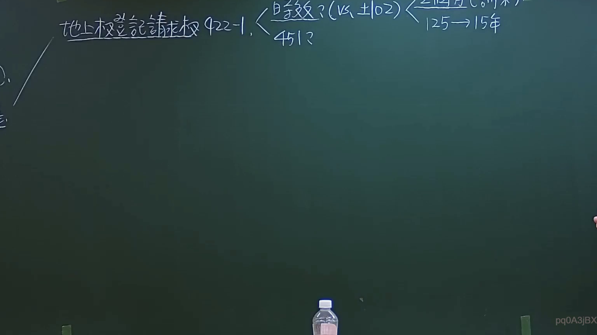

# 🎥 影音教材板書校對筆記
- **來源影片**: [預約27 2024-09-05 01-34-00-883](file:///J:/民法/ch27/預約27 2024-09-05 01-34-00-883.mp4)
- **課程分類**: `[民法`
- **課堂章節**: `ch27]`
- **影片時間戳記**: `03:32:45` (12765 秒)
- **板書類型**: `影音板書`
- **偵測時間**: 2026-07-19 16:46:20

## 🔍 擷取黑板板書對照圖


## 🧠 AI 智慧理解與知識庫演化註記
：
1. **板書內容辨識**：
   - 「地上權登記請求權 422-1」
   - 「時效？(vs. 102)」
   - 「451？」
   - 「125 -> 15年」

2. **法律學理與爭點解讀**：
   - 本板書探討的核心爭點為「民法第422條之1之地上權登記請求權，是否適用消滅時效」。
   - **民法第422條之1**：規範租用基地建築房屋之地上權登記請求權。
   - **消滅時效爭議**：板書中的「時效？」意指該請求權是否因長期不行使而罹於消滅時效。
   - **對照條文**：
     - **民法第125條**：一般請求權消滅時效為15年。板書「125 -> 15年」即指此一般時效規定。
     - **實務見解（對照102與451）**：板書中出現的「102」與「451」應係指最高法院相關判決或學說爭議編號。學說與實務上曾爭論該請求權屬物權性質或債權性質，若視為債權性質，則有消滅時效適用（15年）；若視為物權形成權之類推，則可能無消滅時效適用。老師在此係引導學生思考在基地租賃關係中，承租人行使該請求權的時效限制。

## 📊 可編輯之 Mermaid 關係流程圖
```mermaid
：
graph TD
    A["地上權登記請求權(民法422-1)"] --> B{"適用消滅時效?"}
    B --> C["主張適用消滅時效"]
    C --> D["依民法125條"]
    D --> E["15年時效期間"]
    B --> F["主張無消滅時效"]
    F --> G["學說/實務爭議(參考102, 451)"]
```

## ✍️ 操作者手動校對修改區
<!-- 您可以直接修改上方的文字或調整 Mermaid 區塊中的節點，Obsidian 會即時重新渲染 -->
- [ ] 欄位結構與法律邏輯已校對無誤。
- **校對筆記**: 
