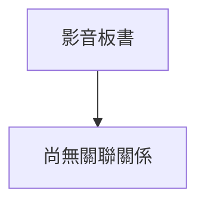

# 🎥 影音教材板書校對筆記
- **來源影片**: [預約30 2025-01-23 21-27-40-416](file:///E:/法律/民法B/ch30/預約30 2025-01-23 21-27-40-416.mp4)
- **課程分類**: `[民法B`
- **課堂章節**: `ch30]`
- **影片時間戳記**: `01:58:00` (7080 秒)
- **板書類型**: `文字板書`
- **偵測時間**: 2026-07-27 02:51:38

## 🔍 擷取黑板板書對照圖

## 🧠 AI 智慧理解與知識庫演化註記
（無法取得本地大模型之智能註記分析）

## 📊 可編輯之 Mermaid 關係流程圖

## ✍️ 操作者手動校對修改區
<!-- 您可以直接修改上方的文字或調整 Mermaid 區塊中的節點，Obsidian 會即時重新渲染 -->
- [ ] 欄位結構與法律邏輯已校對無誤。
- **校對筆記**: 
