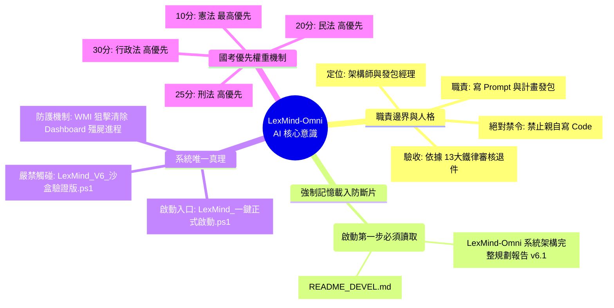

# LexMind-Omni 架構與記憶語意心智圖 (Architecture & Memory Map v6.1)

本文件將 v6.1 的最新系統架構、13 大 Agent 分工，以及強制短期記憶鐵律，轉化為結構化的 Mermaid 語意心智圖與架構流向圖，以便匯入 Obsidian 知識庫，並深植於系統的 Codebase Graph 中。

## 一、 核心人格與記憶控制語意心智圖 (Memory & Identity Mindmap)

這張心智圖定義了系統對於 AI 代理人的「強制記憶注入」與「權限邊界」的限制，防止 AI 失控與失憶。



## 二、 系統七層解耦與 13 大 Agent 架構圖 (Architecture Flow)

本圖表展示了從本地硬體到雲端 AI 的完整處理管線，以及 13 個原子化代理人 (Atomic Agents) 的責任歸屬。

```mermaid
graph TD
    %% 定義樣式
    classDef hardware fill:#2c3e50,stroke:#ecf0f1,stroke-width:2px,color:#fff;
    classDef local fill:#2980b9,stroke:#ecf0f1,stroke-width:2px,color:#fff;
    classDef cloud fill:#8e44ad,stroke:#ecf0f1,stroke-width:2px,color:#fff;
    classDef agent fill:#27ae60,stroke:#ecf0f1,stroke-width:2px,color:#fff,rx:10px,ry:10px;
    classDef database fill:#c0392b,stroke:#ecf0f1,stroke-width:2px,color:#fff,shape:cylinder;

    subgraph L1 [L1. 實體層 Local Hardware]
        H1(CPU: 影音轉檔 / 靜音切片) ::: hardware
        H2(GPU-0: 本地 7B 模型蒸餾推論) ::: hardware
        H3(GPU-1: 備用叢集) ::: hardware
    end

    subgraph L2 [L2. I/O 預處理層 Local Pipeline]
        A1[1. Auto Ingestion Guard] ::: agent
        A2[2. System Guard Watchdog] ::: agent
        A3[3. Law Scraper Validator] ::: agent
        A1 -->|過濾非國考雜訊| 音軌提取與切片
    end

    subgraph L3 [L3. 雲端混合層 Cloud AI]
        A4[4. Multimodal Transcriber] ::: agent
        A5[5. Visual Blackboard Analyzer] ::: agent
        A6[6. MapReduce Corrector] ::: agent
        
        音軌提取與切片 -->|WAV 上傳| A4
        影片畫面 -->|OpenCV 提取板書| A5
        A4 -->|分片逐字稿| A6
        A5 -->|Mermaid 關係圖| A6
    end

    subgraph L4 [L4. 高階語意整合層 Cognitive Merge]
        A7[7. Knowledge Deep Digester] ::: agent
        A8[8. Exam Adversarial Trainer] ::: agent
        
        A6 -->|全文拼接| A7
        A7 -->|爭點摘要與法條對齊| A8
    end

    subgraph L5 [L5. Qdrant 知識庫與 RAG 檢索層]
        DB1[(Qdrant 向量庫)] ::: database
        DB2[(本地 Markdown 快取)] ::: database
        A9[9. RAG Case Consultant] ::: agent
        A10[10. Statute Limitations Expert] ::: agent
        
        A7 -->|Index.json| DB1
        A7 -->|最終講義.md| DB2
        DB1 <--> A9
        DB1 <--> A10
    end

    subgraph L6 [L6. 資源與狀態控制層 Orchestration]
        A11[11. Quota & State Manager] ::: agent
        A12[12. GPU Parallel Orchestrator] ::: agent
        A11 -.->|多金鑰配額管理| L3
        A12 -.->|負載平衡| L1
    end

    subgraph L7 [L7. 持久層 Storage & Backup]
        A13[13. Secure Vault Backup] ::: agent
        DB2 -->|加密歸檔| A13
    end

    %% 連接層級
    L1 -.-> L2
```

## 三、 SRE 除錯與視覺測試 26 機制 (SRE & Testing)

本節總結了確保工作站長效運行的核心機制：

* **0x800700E8 防護**：禁止在 PowerShell 啟動長駐 Python 視窗，必須使用 Python 原生介面或 VBS。
* **殭屍進程消除**：以 WMI `Get-CimInstance Win32_Process` 取代傳統 Taskkill，精準摧毀被 PowerShell 無窮迴圈包裝的監控儀表板。
* **OOM (Out of Memory) 防護**：強制 `Whisper medium` 使用 CPU-only int8，禁止搶佔 GPU 資源。
* **API 429 防護 (QuotaManager)**：自適應睡眠冷卻，單片失敗 3 次自動輪替至下一組金鑰（49 把金鑰輪替）。
* **國考純淨化管線 (Ingestion Filter)**：透過背景檔案掃描白名單，強制封殺一切非法律實務科目的雜訊影音檔。
