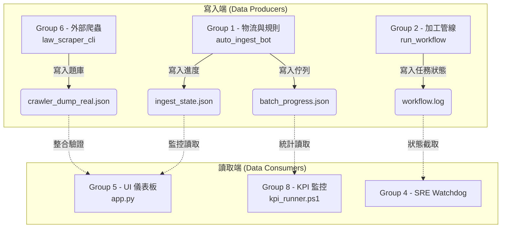
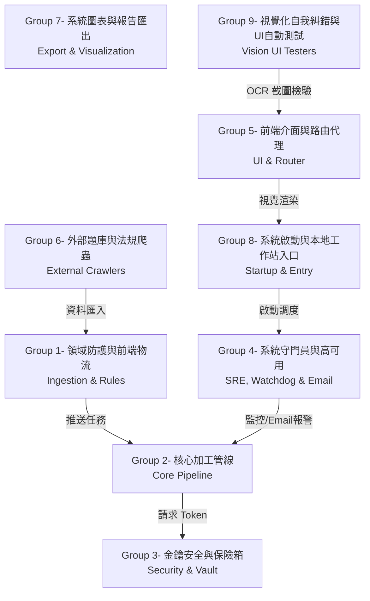

# LexMind-Omni 系統全域依賴關係與防呆地圖 (Dependency Index)

> [!WARNING]
> **給所有 AI 代理人與開發者的最高警告：**
> 這是一份全域強制的相依性地圖！不要以為你只修改了一個小檔案！
> 系統中許多模組是**高度解耦**的，這表示你修改了 A 檔案的輸出，B 檔案不會在語法上報錯，但**會在執行期完全癱瘓**！
> **修改任何檔案前，請務必對照以下九大群組，確認你的修改不會引發蝴蝶效應。**

## 🔄 第一部分：核心架構痛點防護 - 資料流交連 (Data Flow Dependency)

**【致命盲區警告】**：過去的 AI 經常認為 Dashboard (儀表板) 讀取的 `.json` 是「假資料」，並擅自將監控程式閹割。
事實上，這是非同步解耦架構！所有的 JSON 檔案都是生產線即時打出的心血結晶，若擅自修改生產線的資料格式，將直接導致儀表板癱瘓。

---

## 🧩 第二部分：九大系統關聯群組 (The 9 Dependency Groups)

### Group 1: 領域防護與前端物流 (Ingestion & Rules)
- **檔案**：`national_exam_rules.py`, `auto_ingest_bot.py`, `batch_exam_trainer.py`
- **相依警告**：負責掃描、吸收及國考權重判定。修改評分標準 (`national_exam_rules.py`) 時，必須同步檢查 `auto_ingest_bot.py` 的過濾邏輯與 `batch_exam_trainer.py` 的訓練權重。

### Group 2: 核心加工管線 (Core Pipeline)
- **檔案**：`run_workflow.py`, `workflow_helper.py`, `file_watcher.py`, `preprocess_media.py`, `chunk_planner.py`, `stt_runner.py`, `merge_transcript.py`, `markdown_formatter.py`, `visual_analyzer.py`, `process_multimodal_file.py`, `whisper_pool.py`, `win32_kernel.py`
- **相依警告**：負責音訊切片、轉錄與精校排版。修改時必須確保「多執行緒併發 (Concurrency)」及「跨進程 JSON 狀態寫入」的安全。任何格式的變動都會直接影響 Group 5/8。

### Group 3: 金鑰安全與保險箱 (Security & Vault)
- **檔案**：`quota_manager.py`, `utils/vault.py`, `utils/key_manager.py`
- **相依警告**：負責 Vertex AI / Gemini 金鑰加密解密與 429 斷路器輪替。絕不可破壞此處的斷路保護機制。

### Group 4: 系統守門員與高可用 (SRE, Watchdog & Email Alerts)
- **檔案**：`sre_watchdog.py`, `auto_healer.py`, `check_stuck.py`, `auto_verify.py`, `monitor_progress.py`
- **相依警告**：負責監控卡死並發送 **SMTP Email 警報** 以及自動修復。
  - **【生產者-消費者高耦合警告】**：`sre_watchdog.py` 負責觀測錯誤並產出 `sre_incident_queue.jsonl`，而 `auto_healer.py` 專職監聽此佇列進行背景自我修復。這兩支程式是互賴的雙生系統。修改日誌寫入格式時，必須同步修改兩者，否則會導致哨兵通報但自癒引擎無反應。嚴禁在除錯時閹割掉 Email 發送邏輯。

### Group 5: 前端介面與路由代理 (UI & Router)
- **檔案**：`app.py`, `ollama_router.py`, `gemini_proxy.py`
- **相依警告**：修改儀表板 UI (Streamlit) 或 CSS 時，**絕對必須**同步更新 Group 9 (視覺測試機器人) 的截圖 OCR 辨識邏輯。

### Group 6: 外部題庫與法規爬蟲 (External Question Bank Crawlers)
- **檔案**：`bot_ultimate_real_crawler.py`, `bot_ultimate_600_crawler.py`, `bot_ultimate_hierarchy_crawler.py`, `law_scraper_cli.py` (位於 `C:\LocalAI_Workstation\`)
- **相依警告**：負責向外擴充題庫。抓取下來的資料格式必須完全與本機 DB 的解析格式對齊。

### Group 7: 系統圖表與報告匯出 (Export & Visualization)
- **檔案**：`export_plan.py`, `export_plan_api.py`, `export_plan_png.py`

### Group 8: 系統啟動與本地工作站入口 (Startup & Workstation Entry)
- **檔案**：`一鍵啟動三大監控視窗.ps1`, `LexMind一鍵啟動_終極版.ps1`, `dashboard_runner.ps1`, `kpi_runner.ps1` (位於 `C:\LocalAI_Workstation\`)
- **相依警告**：系統最高入口點！**絕對禁止 AI 擅自覆蓋、魔改或閹割這些啟動腳本。**

### Group 9: 視覺化自我糾錯與 UI 自動測試 (Vision UI Testers)
- **檔案**：`bot_ultimate_tester.py`, `bot_pairwise_ui_tester.py`, `capture_streamlit.py`, `test_screenshot.py` (位於 `C:\LocalAI_Workstation\`)
- **相依警告**：負責自動截圖與 OCR 解讀儀表板。一旦 Group 5 的畫面佈局改變，這裡的 OCR 座標與關鍵字也必須同步更新。
